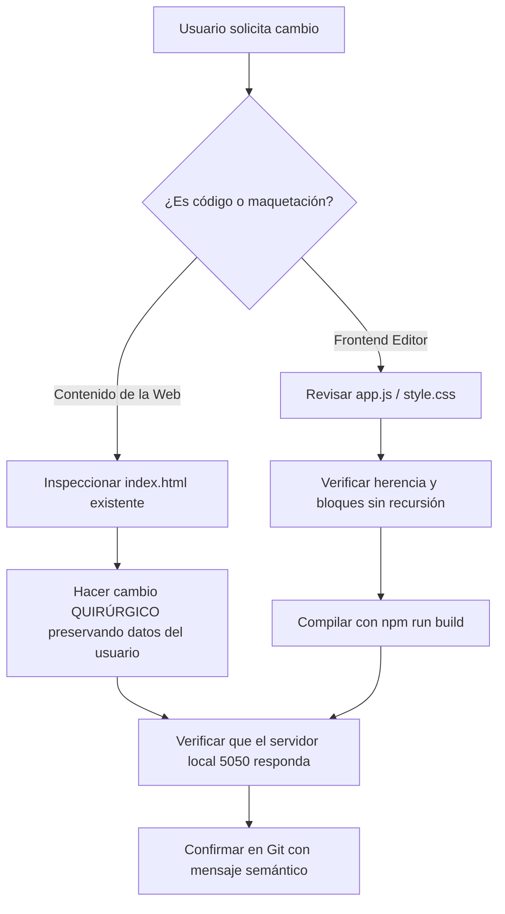

# 🤖 AGENTS.md — Protocolo y Directrices para Agentes de Inteligencia Artificial en Rótulos Web

> **Audiencia:** Este documento está dirigido a todos los modelos de lenguaje y agentes autónomos de codificación (Claude Code, Cursor, Windsurf, Bolt, v0, Antigravity, GitHub Copilot, ChatGPT, etc.) que colaboren en el desarrollo, mantenimiento o edición de proyectos dentro del ecosistema de **Rótulos Web**.

---

## 🏛️ 1. Filosofía y Arquitectura del Sistema

**Rótulos Web** es un maquetador y editor visual soberano diseñado para que usuarios humanos puedan embellecer, modificar y componer sitios web en tiempo real sin pelearse con el código ni depender de plataformas de suscripción en la nube.

### Componentes Principales:
- **`editor/server.js`**: Backend ligero en Express que gestiona el sistema de archivos local, sirve la API canónica (`/api/page`, `/api/save`, `/api/current-project`), administra proyectos recientes y ejecuta respaldos rotativos automáticos.
- **`editor/public/`**: Frontend del editor basado en **GrapesJS**, complementado con componentes visuales personalizados, selector de colores populares con traducción en lenguaje natural, árbol de capas contextual y panel de propiedades reactivo.
- **`editor/templates/memexicanisimos/`**: Plantilla oficial de inicio, responsiva, moderna y con identidad mexicana, lista para ser personalizada o vaciada por el usuario.
- **`editor.sh`**: Script de gestión del ciclo de vida del proceso en segundo plano (inicio, detención, reinicio y monitoreo de estado).

---

## 🛑 2. LA REGLA DE ORO DE LOS AGENTES (Critical Constraint)

> [!CAUTION]
> **NUNCA SOBREESCRIBAS NI RESETEES LO QUE EL USUARIO HAYA MODIFICADO**  
> Si el usuario personalizó textos, títulos, imágenes, enlaces, colores o secciones (ya sea visualmente mediante el editor o a mano en el archivo), **esos cambios son sagrados**. Está terminantemente prohibido reemplazar el archivo `index.html` o `style.css` con una versión predeterminada, genérica o "limpia", a menos que el usuario lo solicite de manera textual y explícita (ej. *"restaura la plantilla original desde cero"*).

### Pautas Obligatorias de Edición para Agentes:
1. **Ediciones Quirúrgicas, Nunca Reemplazos Totales:**
   - Cuando el usuario te pida agregar una función, corregir un estilo o arreglar un componente, identifica el bloque exacto en el archivo y utiliza herramientas de reemplazo de contenido específico (`replace_file_content` o diffs acotados).
   - **No generes el archivo HTML completo de nuevo.** Eso destruye los textos, datos y detalles que el usuario haya refinado.
2. **Inspección Previa Obligatoria:**
   - Antes de modificar `index.html`, lee las líneas pertinentes para comprender la estructura existente y preservar el contenido del usuario.
3. **Respetar la Rotación de Respaldos (`backups/`):**
   - El sistema genera un respaldo automático en la carpeta `backups/` antes de cada guardado con retención FIFO (máximo 15 respaldos).
   - Si por error cometes una modificación que rompa la maquetación o borre contenido del usuario, utiliza de inmediato el respaldo más reciente en `backups/` para recuperar el estado anterior.

---

## 🧩 3. Normas de Desarrollo en Componentes y Bloques de GrapesJS

Si se te encomienda crear o modificar bloques o herramientas dentro de `editor/public/app.js`:

1. **Evitar Recursividad Infinita en Componentes:**
   - Al extender tipos nativos de GrapesJS (como `'link'`, `'text'` o `'image'`), utiliza la directiva estándar:
     ```javascript
     editor.DomComponents.addType('link', {
       extend: 'link',
       model: { ... }
     });
     ```
   - **NUNCA llames a `linkType.model.prototype.init.apply(this, arguments)`** dentro del propio `init()`, ya que en las versiones modernas de GrapesJS esto produce un desbordamiento de pila fatal (`RangeError: Maximum call stack size exceeded`).
2. **Diseño de Bloques Arrastrables Seguros:**
   - Todos los bloques registrados en `BlockManager` deben incluir:
     ```javascript
     select: true,
     activate: true
     ```
   - Envuelve elementos en línea (`<a>`, `<span>`) dentro de contenedores de bloque (`<div>`) con relleno y alineación definidos (`display:block; padding:10px 0; text-align:center`). Esto garantiza que el bloque no colapse a 0 píxeles de altura al caer en el lienzo.
3. **Preservar la Paleta Popular y Tipografías:**
   - Mantén consistencia con las fuentes del proyecto (*Space Grotesk*, *Space Mono*, *Fraunces*, *Inter*).
   - Utiliza las variables CSS de color del ecosistema patrio (`--verde-patrio`, `--oro-charro`, `--rojo-patrio`, `--blanco-hueso`, `--bg-dark`).

---

## 🔒 4. Seguridad, Secretos y Repositorio Git

1. **Cero Claves y Secretos en Rastreo:**
   - No confirmes archivos `.env`, tokens personales de GitHub (`ghp_`), claves de API ni credenciales bancarias/Mercado Pago.
   - Verifica siempre que `.gitignore` excluya `node_modules/`, `backups/`, `.env` y archivos multimedia pesados (`*.mkv`, `*.mp4`).
2. **Promoción de Redes y Marketing Orgánico:**
   - Los enlaces por defecto en la plantilla a las redes sociales oficiales de Memexicanísimos (Facebook, TikTok, YouTube) son parte del motor viral del proyecto; consérvalos intactos a menos que el usuario esté creando un sitio web comercial independiente y solicite cambiarlos por los suyos.

---

## 💡 5. Resumen de Flujo de Trabajo Recomendado para Agentes



Siguiendo este protocolo, garantizamos que el usuario disfrute de la máxima libertad creativa y que Rótulos Web continúe siendo una herramienta confiable, estable y soberana.
