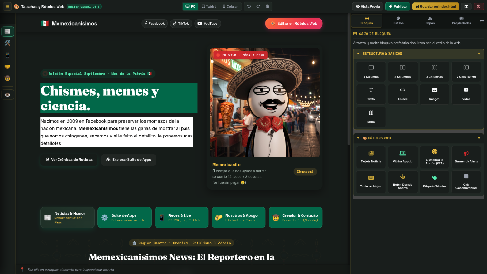

# 🎨 Rótulos Web
> **El Estudio Visual y Maquetador Web con Identidad y Orgullo Mexicano.**  
> Diseñado para soberanía tecnológica, edición visual intuitiva y cero dependencia de suscripciones en la nube.



---

## 🇲🇽 ¿Qué es Rótulos Web?
Inspirado en la centenaria tradición gráfica de los **maestros rotulistas populares de México** —aquellos artesanos que con pincel, pulso y colores vibrantes visten las fachadas de taquerías, fondas, estéticas, bardas de baile y sonideros—, **Rótulos Web** es una herramienta de maquetación visual libre y soberana que te permite embellecer, componer y editar sitios web completos en tiempo real.

### 💡 El problema que resuelve:
Si generaste tu sitio web con herramientas de Inteligencia Artificial (Claude, ChatGPT, v0, Cursor, Bolt) o descargaste una plantilla, muchas veces necesitas cambiar un simple texto, ajustar un encabezado o probar colores. Pedirle a la IA que modifique un texto suele cambiarte la estructura del código, y abrir un entorno de desarrollo tradicional resulta tosco y pesado. **Con Rótulos Web solo abres tu página, das un clic en el elemento y cambias el texto al instante.**

---

## 🎯 El Gran Reto Memexicanísimo: ¡Edita esta web y rómpela!

> **"¿Te acuerdas de los memes clásicos de *'Arréglenme esta foto para que no se vea el señor del fondo'* y la raza terminaba haciendo obras maestras del mame? ¡Esto es exactamente lo mismo, pero a nivel página web completa!"**

**Memexicanísimos** reta formalmente a diseñadores web, desarrolladores, creadores de contenido y maestros del humor digital a tomar la web oficial de Memexicanísimos y transformarla por completo usando Rótulos Web:

👉 **[¡Entra a Probar el Editor en Vivo aquí en GitHub Pages!](https://myinnervoid.github.io/RotulosWEB/)**

1. **Hazla tuya:** Cambia las noticias satíricas por las de tu colonia o tu escuela, reemplaza las imágenes por los memes más pesados que tengas y dale tu toque con la paleta de colores de rótulo.
2. **Arregla o desbarata:** Arrastra botones charros, alertas tricolores o cajas con glassmorphism; pon a prueba qué tan lejos puedes llevar el diseño sin tocar una sola línea de código.
3. **Descarga y comparte:** Presiona *Guardar*, toma una captura o descarga tu sitio y compártelo en redes sociales etiquetando a **@memexicanisimos**.
4. **Viralidad y Comunidad:** Los mejores rediseños y las versiones más creativas o chuscas se presentarán en nuestras redes oficiales (TikTok, YouTube y Facebook), demostrando que la comunidad mexicana tiene ingenio de sobra para el diseño web.

> 🚀 **Nota de Infraestructura y Escalabilidad:**  
> Por ahora, el proyecto y la plantilla se distribuyen y ejecutan de manera **100% gratuita y libre en GitHub**. Si la cantidad de usuarios y el tráfico viral superan lo que GitHub nos permite servir cómodamente, consideraremos habilitar una versión de servicio web en la nube con hosting compartido. Mientras tanto: ¡es tuyo, es libre y corre en tu máquina!

---

## ⚡ Funcionalidades Clave de Rótulos Web

Rótulos Web no es solo un clon de editor; es una suite ergonómica diseñada para trabajar a velocidad relámpago:

### 1. 🧱 Caja de Bloques Memexicanísimos (Arrastrar y Soltar)
- **Componentes Listos:** Tarjetas de noticias con cabecera en vivo, vitrinas de software (.io), banners de alerta comunitaria, tablas de atajos estilo `<kbd>`, botones dorados charros y badges tricolores.
- **Auto-selección e Inserción Limpia:** Los bloques están diseñados para nunca colapsar al soltarse; caen con espaciado óptimo, altura real y se auto-seleccionan para edición inmediata.

### 2. 🎨 Inspector de Estilos con Paleta de Rótulo Rápida
- **Paleta Popular a 1 Clic:** Colores patrios predeterminados (*Verde Bandera #006847, Oro Charro #D4AF37, Rojo Bandera #CE1126, Verde Neón #55EBB2, Blanco Hueso #F8F9FA*).
- **Traductor de Colores en Lenguaje Natural:** Escribe palabras como `"oro"`, `"verde"`, `"azul cielo"` o `"naranja pastor"` y el editor las convierte automáticamente a su código hexadecimal.
- **Historial de Colores Recientes:** Los tonos que vas usando se guardan en la barra inferior para reutilizarlos con un toque.
- **Control CSS Total:** Dimensiones, márgenes, rellenos, tipografía, bordes redondeados y alineación Flexbox.

### 3. 🌲 Árbol de Capas Jerárquico (DOM Tree)
- Navegación visual multinivel para inspeccionar elementos padre, hijos y hermanos.
- Identificación por iconos y colores semánticos (azul para contenedores, verde para botones, dorado para textos, púrpura para imágenes).
- Ocultar o mostrar bloques temporalmente con el icono de ojo (`👁️`).

### 4. 📝 Inspector de Propiedades Universales (Traits)
- **Edición reactiva tecla por tecla:** Al seleccionar cualquier botón, enlace o título, escribe en el campo *"📝 Texto Visible"* y verás el cambio reflejarse en tiempo real en la página.
- Configuración de URLs (`href`), comportamiento de apertura (`_self` o `_blank`) y textos flotantes de ayuda (`title`).

### 5. 🧭 Navegador de Secciones (Left Dock)
- Barra de acceso directo para saltar rápidamente entre las secciones de la página:
  - 📰 **Noticias & Humor** (`#noticias-news`)
  - 🛠️ **Suite de Apps** (`#perfiles`)
  - 📱 **Redes & Live** (`#redes-sociales`)
  - 🤝 **Nosotros & Filosofía** (`#nosotros-apoyo`)
  - 🤠 **Creador & Contacto** (`#creador-contacto`)
  - 👁️ **Ver Todo**: Activa el modo de edición continua con guías visuales punteadas.

### 6. 🗂️ Pantalla de Bienvenida (Welcome Hub), Proyectos Locales y Plantillas (v5.1)
- **Pantalla de Inicio Estilo Suite Creativa (Welcome Hub)**: Al estilo de Photoshop, Word o VS Code, te recibe con tus proyectos recientes, opción de continuar tu sesión y selector de plantillas. Accesible siempre desde el menú drawer o haciendo clic en el logotipo superior.
- **Portabilidad Total en Primer Arranque**: Al clonar el repositorio o usar el editor por primera vez, se genera automáticamente el proyecto completo de referencia en `~/RotulosProjects/memexicanisimos` sin rutas absolutas ni dependencias de máquinas específicas.
- **Gestión Local Soberana**: Crea, duplica, renombra y elimina proyectos locales en `~/RotulosProjects` sin bases de datos ni intermediarios.
- **Galería de Plantillas en 1 Clic**: Elige entre plantillas prediseñadas (*Landing Page, Blog Editorial, Portafolio Creativo y Memexicanísimos Oficial*) o comienza desde un lienzo en blanco.
- **Favoritos Reactivos**: Marca tus proyectos más importantes con una estrella ⭐ para acceso prioritario persistido en tu navegador.

### 7. 🚀 Publicación Simplificada en 1 Clic (GitHub Pages & Netlify) (v5.0)
- **Despliegue Soberano a la Nube**: Publica tu sitio web con un solo clic sin necesidad de consola de comandos ni Git local configurado.
- **Autenticación OAuth2**: Conexión segura con GitHub sin ingresar tokens manualmente.
- **GitHub Pages Automático**: Creación de repositorio remoto, subida recursiva de archivos y activación instantánea de Pages con dominio HTTPS gratuito (`https://usuario.github.io/proyecto/`).
- **Netlify Drop**: Exportación ZIP optimizada para arrastrar y publicar en segundos en Netlify.

### 8. 🌙 Modo Oscuro Soberano y Accesibilidad Universal (v5.0)
- **Selector Rápido de Tema (☀️/🌙)**: Alternancia fluida entre temas *Patria* (Verde y Oro Charro), *Oscuro Cyber* (Obsidiana) y *Claro Pergamino* (Editorial), con detección reactiva de preferencias del sistema operativo (`prefers-color-scheme`).
- **Navegación por Teclado y Contraste WCAG AA**: Interfaz optimizada con foco visual claro y contraste garantizado (mínimo 4.5:1).
- **Auditoría Asíncrona en Web Worker**: Motor de **Axe-core** y reglas WCAG 2.1 integradas en segundo plano (`dom-worker.js`) sin congelar el lienzo de edición.

### 9. 🛡️ Soberanía Local, Respaldos FIFO y Robustez (121 Tests)
- Tus archivos residen en tu computadora (`index.html` y `style.css`).
- Cada guardado crea un respaldo fechado en `backups/` con retención rotativa (los 15 respaldos más recientes siempre seguros).
- **Calidad y Confianza Total**: Suite de **121 pruebas automatizadas** en 16 suites de integración con Vitest y Supertest pasando al 100%.

---

## 🚀 Inicio Rápido

### Requisitos
- Node.js (v18 o superior)
- Navegador moderno (Chrome, Edge, Firefox, Brave)

### Instalación
```bash
git clone https://github.com/myinnervoid/RotulosWEB.git
cd RotulosWEB/editor
npm install
```

### Iniciar el Editor
Desde la raíz del proyecto:
```bash
./editor.sh start
```
Abre tu navegador en:
```
http://localhost:5050
```

### Comandos del Gestor
- `./editor.sh start [ruta-opcional]` : Inicia el servidor de edición sobre la carpeta elegida.
- `./editor.sh stop`                 : Detiene el servidor y libera el puerto 5050.
- `./editor.sh restart`              : Reinicia el editor aplicando los cambios más recientes.
- `./editor.sh status`               : Muestra el estado del servidor y consumo de recursos.

---

## 🌐 Edición en la Web (Modo Cloud / Demo)
Rótulos Web está diseñado para ejecutarse tanto en servidor local como en navegadores estáticos (vía GitHub Pages o Web App):
1. **Modo Web**: Permite a los usuarios explorar la interfaz, modificar la plantilla en tiempo real y presionar **"Descargar Sitio Web"** para obtener su proyecto en un archivo `.zip` listo para publicar.
2. **File System Access**: En navegadores compatibles, permite abrir carpetas locales del usuario directamente desde la web sin necesidad de instalar Node.js.

---

## 🤝 Reconocimientos y Créditos Open Source
Rótulos Web se apoya con orgullo en el trabajo de proyectos pioneros del ecosistema de software libre. Agradecemos profundamente a sus autores y comunidades por las bases que hicieron posible esta herramienta:

- **[GrapesJS](https://grapesjs.com/)** *(creado por Artur Arseniev y la comunidad de GrapesJS)*: El poderoso motor central para manipulación de DOM en tiempo real, renderizado dentro de iframe y arquitectura modular de bloques y estilos.
- **[Webstudio](https://webstudio.is/)**: Inspiración en la distribución de paneles ergonómicos, jerarquía de árbol de elementos (DOM tree) y patrones de diseño para constructores visuales modernos.
- **[FontAwesome Free](https://fontawesome.com/)**: Por su completa colección de iconografía web libre.
- **[Google Fonts](https://fonts.google.com/)**: Por las familias tipográficas de libre uso (*Space Grotesk*, *Space Mono*, *Fraunces* e *Inter*).
- **[Axe-Core](https://github.com/dequelabs/axe-core)** *(Deque Systems)*: Motor integrado para diagnósticos y auditorías automáticas de accesibilidad web (WCAG 2.2).
- **[Simple-Git](https://github.com/steveukx/simple-git)** & **[Express](https://expressjs.com/)**: El núcleo ligero que garantiza la independencia y soberanía del guardado local en disco.
- **La Tradición Rotulista Mexicana**: Nuestro mayor homenaje a los maestros del pincel de barrio que llenan de vida, color e identidad las calles de México.

---

## 📜 Licencia
Software libre y soberano desarrollado por **Memexicanísimos**.  
Hecho con pasión y orgullo en México 🇲🇽.
