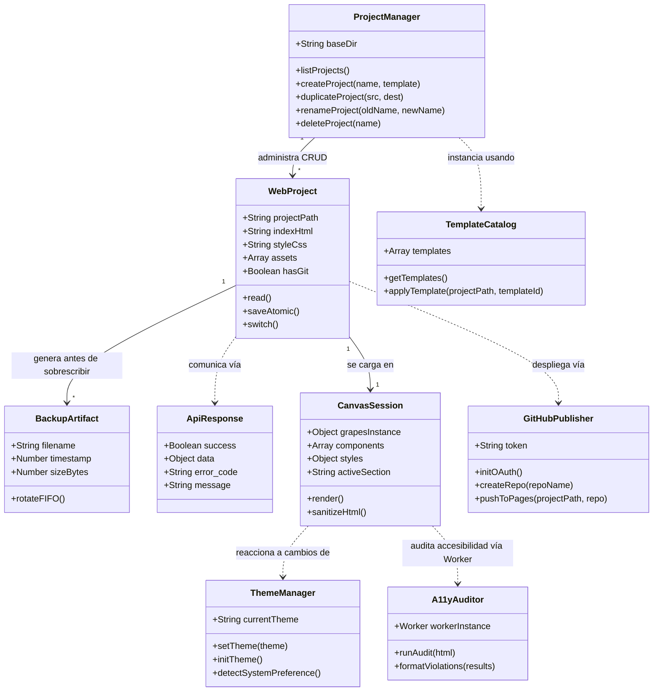
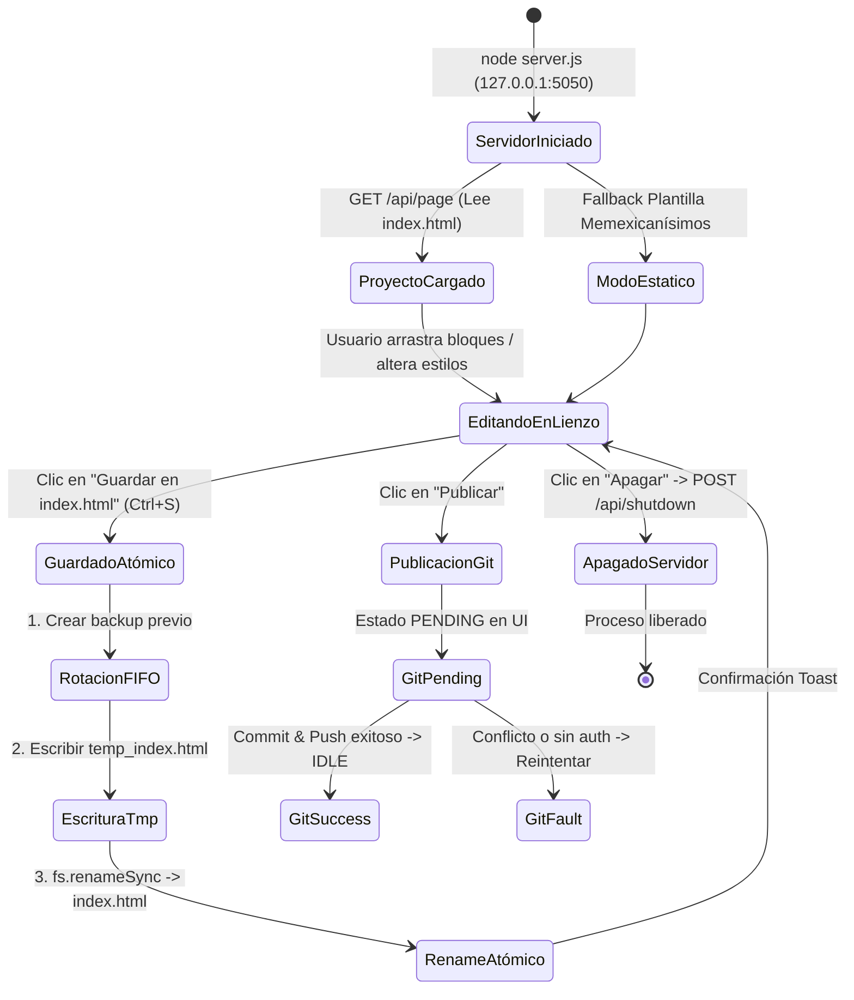

# Modelo de Dominio, Reglas de Negocio e Invariantes — Rótulos Web

Este documento formaliza la arquitectura conceptual, el ciclo de vida del proyecto, las entidades clave y las leyes inmutables del sistema **Rótulos Web** (Estudio Visual Memexicanísimos).

---

## 1. Filosofía y Propósito

**Rótulos Web** es un editor visual universal y soberano diseñado para componer, maquetar, estilizar y mantener páginas web locales sin intermediarios externos, telemetría ni dependencias de plataformas privativas en la nube.

### Principios Fundamentales
1. **Soberanía Digital**: El software corre íntegramente en la máquina del usuario (`localhost` / `127.0.0.1`), controlando sus propios archivos sin subirlos a servicios de terceros.
2. **Offline First**: La tipografía, herramientas, bloques y estilos se resuelven de forma local. La desconexión a internet no interrumpe el flujo de diseño ni la exportación.
3. **Respeto a la Integridad del Código**: El editor no destruye código personalizado, maquetando dentro del contexto estándar de HTML5 y CSS3.

---

## 2. Entidades Principales del Dominio



### 2.1. Proyecto Web (`WebProject`)
- Representa la carpeta en disco que contiene el sitio web en edición.
- Posee obligatoriamente o de forma inferida:
  - `index.html`: Punto de entrada principal y lienzo persistente.
  - `style.css`: Hoja de estilos complementaria.
  - `backups/`: Subdirectorio de resguardo de revisiones históricas.
  - `.git/` (opcional): Repositorio de control de versiones para publicación remota.

### 2.2. Artefacto de Respaldo (`BackupArtifact`)
- Archivo con nomenclatura `index_backup_<TIMESTAMP>.html`.
- Creado en disco *antes* de que cualquier nueva versión sobrescriba el archivo activo.
- Administrado por una cola FIFO con cuota máxima parametrizable (`MAX_BACKUPS`, por defecto 15).

### 2.3. Contrato Canónico de API (`ApiResponse<T>`)
- Formato único y universal para todas las respuestas HTTP JSON del backend:
```typescript
interface ApiResponse<T> {
  success: boolean;
  data: T | null;
  error_code: string | null;
  message: string;
}
```

### 2.4. Sesión de Lienzo (`CanvasSession`)
- Estado en memoria del editor GrapesJS en el navegador.
- Contiene el árbol de componentes DOM, las reglas CSS calculadas, el historial de cambios (Undo/Redo) y la selección de sección activa.

### 2.5. Gestor de Proyectos (`ProjectManager`)
- Entidad encargada de orquestar el ciclo de vida de múltiples sitios locales alojados en `~/RotulosProjects`.
- Provee capacidades CRUD seguras:
  - Listado con metadatos: fecha de modificación, tamaño en bytes, conteo de backups y estado git.
  - Creación con inicialización opcional basada en plantilla.
  - Duplicación atómica profunda (`fs.cpSync`).
  - Renombrado y eliminación protegida (no destructiva si hay bloqueos).
  - Conmutación en caliente de contexto (`switchProject`) sin reiniciar el servidor Express.

### 2.6. Catálogo de Plantillas (`TemplateCatalog`)
- Registro de arquetipos visuales prediseñados y soberanos (`minimal-portfolio`, `modern-saas`, `creative-studio`, `rotulo-taqueria`).
- Cada plantilla encapsula una estructura HTML5 semántica y estilos CSS desacoplados listos para instanciarse en un nuevo proyecto o inyectarse en el lienzo actual con advertencia de sobrescritura.

### 2.7. Publicador Remoto Soberano (`GitHubPublisher`)
- Adaptador de despliegue a la nube opcional manteniendo la soberanía de los datos fuente.
- Flujo OAuth2 sin almacenamiento permanente de tokens: el token reside en el navegador (`localStorage` o memoria de sesión) y se transmite por cabecera segura en cada operación.
- Capacidades:
  - Creación automática o vinculación de repositorio GitHub (`POST /api/publish/github/create-repo`).
  - Sincronización de commits y habilitación nativa de GitHub Pages (`gh-pages` o rama `main` / `docs`).

### 2.8. Gestor de Temas (`ThemeManager`)
- Subsistema frontend responsable del sistema cromático del editor (`light`, `dark`, `system`).
- Opera sobre CSS Custom Properties semánticas (`--bg-primary`, `--bg-secondary`, `--text-primary`, `--accent-primary`) mapeando atributos `data-theme` en `<html>`.
- Sincroniza preferencias en `localStorage` y escucha cambios reactivos del sistema operativo vía `prefers-color-scheme`.

### 2.9. Auditor de Accesibilidad Asíncrono (`A11yAuditor`)
- Motor de validación WCAG 2.1 AA impulsado por `axe-core` y ejecutado fuera del hilo principal (`Web Worker`).
- Garantiza que las auditorías de accesibilidad sobre árboles DOM extensos no congelen el lienzo visual ni degraden la experiencia de edición.

---

## 3. Ciclo de Vida y Máquina de Estados

### 3.1. Máquina de Estados del Servidor y Editor



### 3.2. Fases de la Sesión de Trabajo

1. **Inicialización y Descubrimiento**:
   - El servidor Express verifica los certificados SSL locales (HTTPS con fallback HTTP en puerto 5050).
   - Resuelve la ruta inicial (`projectPath`). Si no se pasa como parámetro, adopta la raíz del repositorio de Memexicanísimos.
   - Envía el HTML y CSS al cliente vía `GET /api/page`.

2. **Edición Soberana en el Cliente**:
   - Se instancian los módulos desacoplados: bloques, paleta cromática, dock lateral, inspector de código y gestor de proyectos.
   - El lienzo de GrapesJS opera aislado dentro de un `iframe` seguro.

3. **Guardado Atómico y Rotación FIFO**:
   - El cliente higieniza el HTML (`getSanitizedHtml`), purgando identificadores temporales `data-gjs-*` y preservando la semántica limpia de HTML5.
   - El servidor copia el archivo actual a `backups/index_backup_<TIMESTAMP>.html`.
   - Se purgan los respaldos más antiguos que excedan el límite `MAX_BACKUPS`.
   - Se escribe el nuevo contenido en un archivo temporal (`temp_index_TIMESTAMP.html`) y se aplica `fs.renameSync` para garantizar atomicidad ante caídas de corriente o fallos de proceso.

4. **Publicación y Entrega**:
   - `POST /api/publish`: Ejecuta `git add -A`, genera un commit con mensaje legible y fecha ISO, y empuja hacia la rama remota (`main`).
   - `POST /api/screenshot`: Lanza una instancia headless de Chrome/Chromium del sistema mediante Puppeteer para producir una renderización fidedigna PNG en resolución Desktop, Tablet o Móvil.

---

## 4. Invariantes Inmutables del Sistema (Leyes Arquitectónicas)

> [!IMPORTANT]
> Estas leyes son requisitos obligatorios y no negociables en cualquier evolución futura de Rótulos Web.

### Ley 1: Límite de Seguridad LAN (Local-Only Boundary)
- El editor solo escucha en interfaces de bucle invertido (`127.0.0.1`, `localhost`) o red local controlada.
- Ninguna petición originada desde dominios externos no autorizados debe tener acceso a las APIs de lectura o escritura de archivos.

### Ley 2: Principio de Cero Pérdida de Datos (Zero Data Loss)
- Está estrictamente prohibido sobrescribir `index.html` de forma directa o destructiva.
- Todo guardado debe ir precedido de:
  1. Verificación de existencia del archivo previo.
  2. Generación de copia de seguridad con timestamp.
  3. Escritura en archivo temporal antes del reemplazo (`fs.renameSync`).

### Ley 3: Política de Retención FIFO Acotada
- El directorio `backups/` nunca debe crecer indefinidamente en disco.
- La rotación debe eliminar los archivos más antiguos cuando la cuenta exceda `MAX_BACKUPS`.

### Ley 4: Soberanía Visual y Offline First
- El editor y su lienzo no deben depender de CDNs externos para su funcionamiento estructural ni para la renderización de sus fuentes (`Space Grotesk`, `Space Mono`).
- Todos los assets tipográficos base deben residir localmente en `public/fonts/`.

### Ley 5: Unicidad y Canonicidad de Contrato (`ApiResponse<T>`)
- Ningún endpoint JSON del backend puede devolver objetos heterogéneos o cadenas de texto sueltas.
- Todo payload debe cumplir estrictamente con los cuatro campos: `success`, `data`, `error_code` y `message`.

### Ley 6: Desacoplamiento de la Mensajería de Error
- El backend emite identificadores canónicos de error (`error_code` listados en `server/error-codes.js`).
- La interfaz de usuario es la encargada de traducir dichos códigos a mensajes empáticos y comprensibles en español mediante `error-messages.js`.

### Ley 7: Sanitización e Inmunidad de Inyección de Rutas (Path Traversal Guard)
- Ninguna operación de proyectos puede aceptar nombres que contengan `..`, barras inclinadas `/` o `\`, o caracteres de escape.
- Toda ruta de proyecto resuelta debe verificarse rigurosamente que resida dentro del directorio base autorizado (`~/RotulosProjects` o el workspace de desarrollo explícito).

### Ley 8: Soberanía de Credenciales y Secretos OAuth
- El servidor backend de Rótulos Web nunca almacena tokens personales (PAT) ni access tokens OAuth en disco ni en variables de configuración persistentes.
- Los tokens residen exclusivamente en el almacenamiento local del cliente y se envían de forma efímera en la cabecera de la petición de publicación correspondiente.

### Ley 9: No Bloqueo del Hilo de Renderizado (Off-Main-Thread Processing)
- Las operaciones computacionalmente intensivas (compresión masiva ZIP con JSZip y análisis sintáctico de accesibilidad con axe-core) deben delegarse a Web Workers dedicados.
- El hilo principal de la interfaz y del iframe de GrapesJS debe mantener 60 FPS estables durante cualquier proceso de exportación o diagnóstico.

